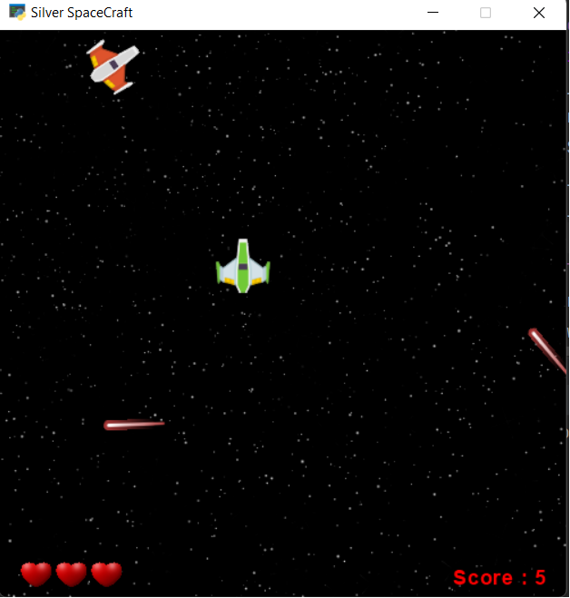
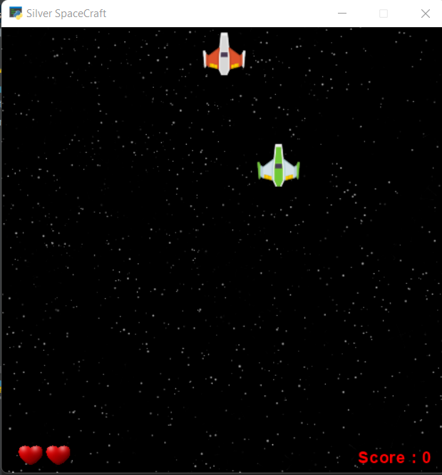
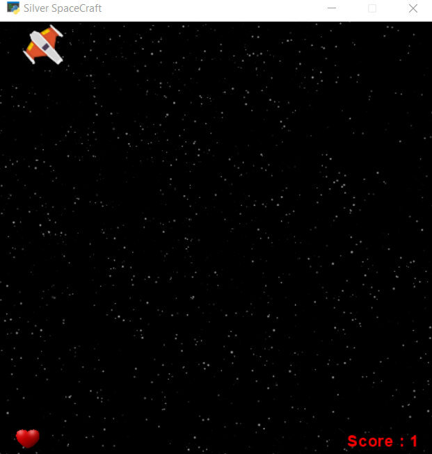
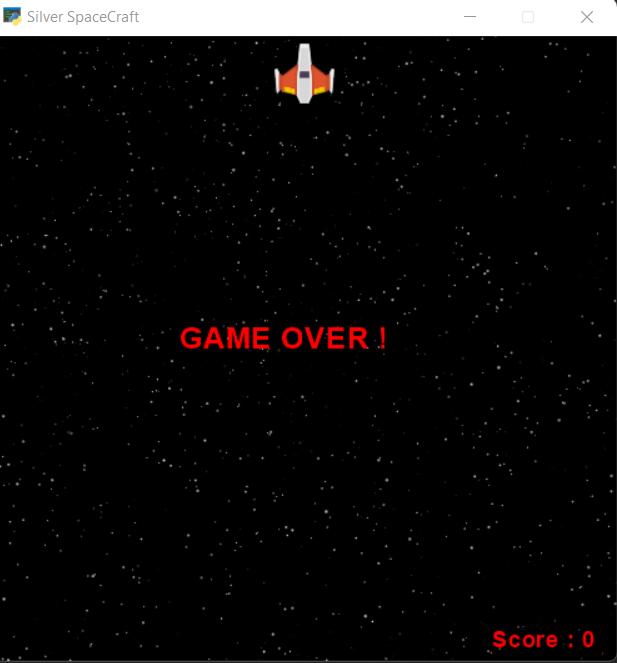

#Silver SpaceCraft
a simple **python** game using [Arcade](https://api.arcade.academy/en/latest/) library

----
_**Some ScreenShot of Output:**_









----
###Usage Note:
```
You can run the program
python main.py 
```
use UP and DOWN keys for rotating and 
RIGHT and LEFT keys for moving the SpaceCraft to different direction

when the SpaceCraft hit the Boundary it reverses its direction


