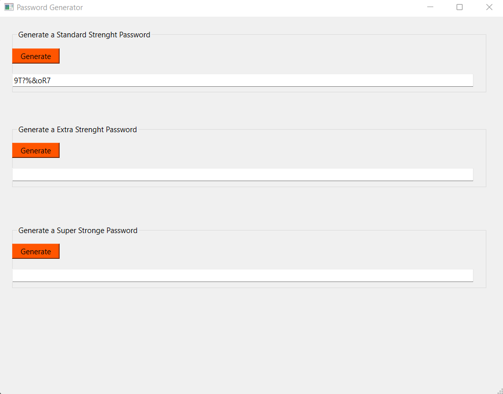
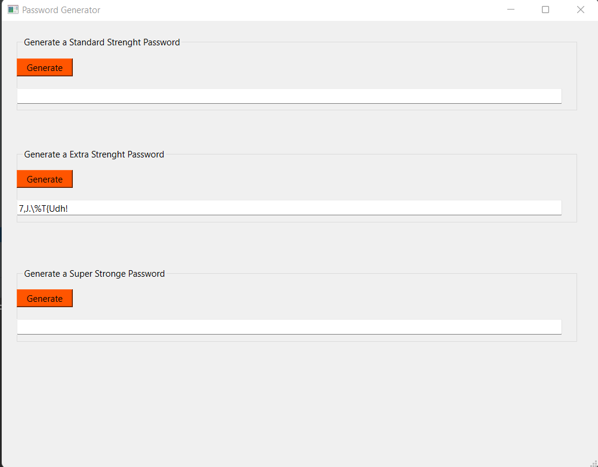
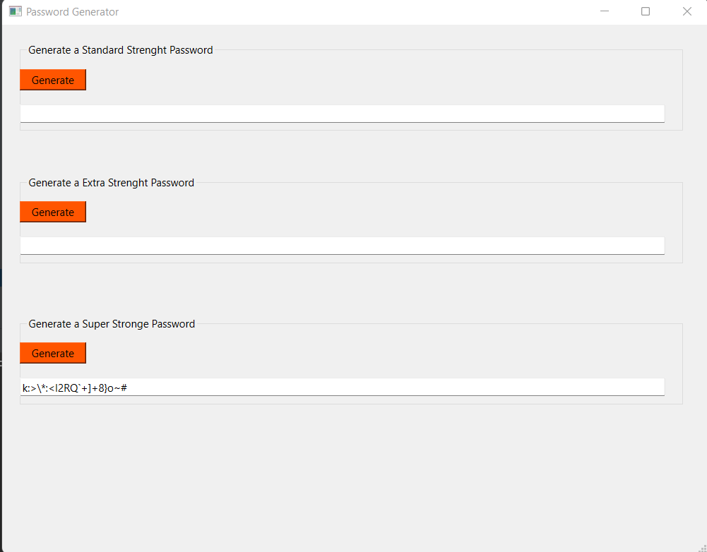

### Password Generator with Python and PySide 6 

----

Options: 

1- Generate a Standard Strength Password (8-Digit):

2- Generate an Extra Strength Password (12-Digit)

3- Generate a Super Strength Password (20-Digit)

