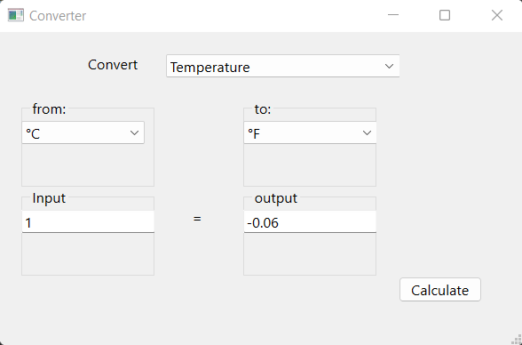

### Unit Convertor With Pyton and Pyside6

Options: 

1- Length Converter: 
* mm
* cm
* m
* km
* inch

2- Weight Converter:
* kg
* g
* T
* P

3- Temperature Converter:
* °C
* °F
* °K

4- Digital Storage Converter:

* bit
* byte
* Kb
* Mb
* Gb
* Tb

